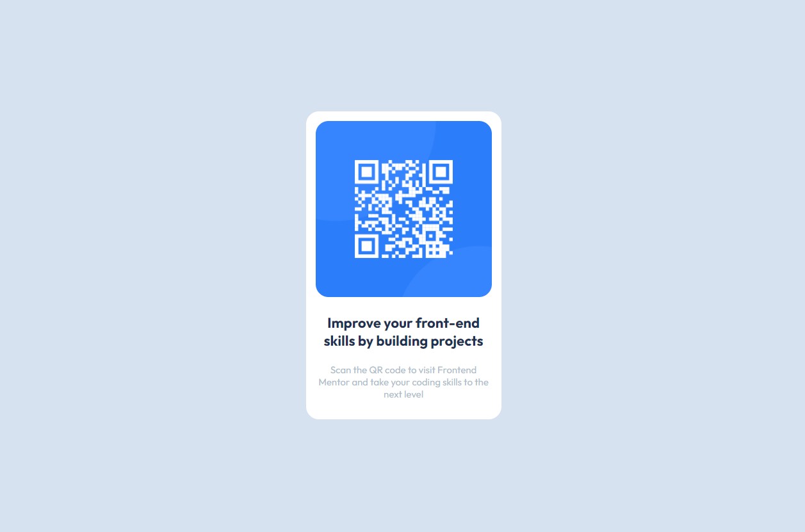

# Frontend Mentor - QR code component solution

This is a solution to the [QR code component challenge on Frontend Mentor](https://www.frontendmentor.io/challenges/qr-code-component-iux_sIO_H). Frontend Mentor challenges help you improve your coding skills by building realistic projects. 
<br>
## Table of contents

- [Overview](#overview)
  - [Screenshot](#screenshot)
  - [Links](#links)
- [My process](#my-process)
  - [Built with](#built-with)
  - [What I learned](#what-i-learned)
  - [Continued development](#continued-development)
- [Author](#author)

<br>

## Overview

### Screenshot




### Links

- Solution URL: [React Source Code](https://github.com/imtiazraqib/frontendmentor-challenges/tree/master/qr-code-component-main/solution/qr-code-viewer/src)
- Live Site URL: [QR Code Companion Live](https://fem-qr-code-companion.netlify.app/)

## My process

### Built with

- Semantic HTML5 markup
- CSS custom properties
- CSS Grid
- Mobile-first workflow
- [React](https://reactjs.org/) - JS library
- [Netlify](https://www.netlify.com/) - Deployment


### What I learned

I utilized React component and props to create this simple and dynamic QR Code Viewer. It was exciting to put my knowledge into action and I was proud to re-create the output from scratch without any help and just relying on what I have learnt.

Working with props, it seemed uneasy for me to pass prop data to the component since text and paragraph content is very long but the reason I chose to do so is for P R A C T I C E. I would ideally refactor the code to store it in a variable and then pass it as a prop data as such:

``` js
function App() {
  const headingText = 'Improve your front-end skills by building projects';
  const descriptionText = 'Scan the QR code to visit Frontend Mentor and take your coding skills to the next level';
  return (
    <div className="App">
      <QRcard source={qrImage}
      heading={headingText}
      description={descriptionText} />
    </div>
  );
}
```

### Continued development

I am currently taking the Coursera Front-end Developer Certificate from Meta and I am proud to be comfortable with React to be able to complete this challenge without any help. Excited to finish my course and build more projects and get super-duper comfortable with React.


## Author

- Website - [Raqib Tech](https://raqib.tech)
- Frontend Mentor - [@imtiazraqib](https://www.frontendmentor.io/profile/imtiazraqib)
- GitHub - [@imtiazraqib](https://github.com/imtiazraqib)
- Twitter - [@ImtiazRaqib](https://www.twitter.com/ImtiazRaqib)
